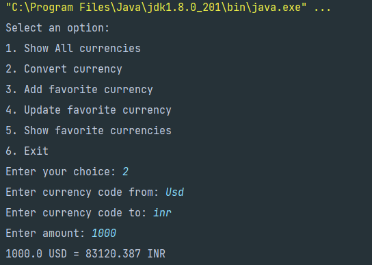
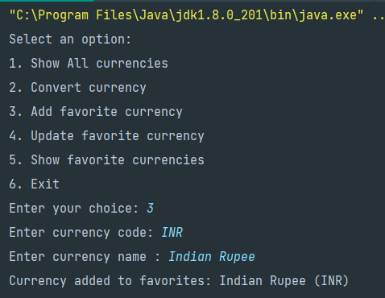
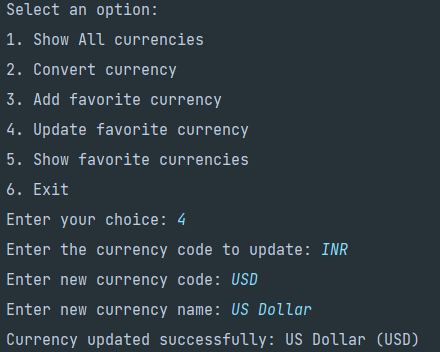
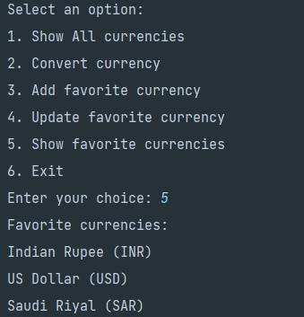

# __Real-Time Currency Converter Documentation__

## __Introduction__

The Real-Time Currency Converter documentation. This guide will walk you through using a Java-based command-line application designed for currency conversion, currency management, and real-time exchange rate retrieval from the web via an API.

## __Pre-requisites__

*	Java Development Kit (JDK): To use this currency converter, you need the Java Development Kit installed on your computer. If you don't have it yet, you can download and install it from the official Oracle website or an open-source distribution like OpenJDK. In this scenario, we used Java 8.
*	API Access Key: We'll be utilizing the "https://exchangerate.host" API for real-time exchange rate data. To access this API, you'll need an API key. If you don't have one yet, you can obtain it by visiting the "exchangerate.host" website and signing up.
  **Note**: If you want to use your own API, Open MainApp.java in any editor, and go to line no.7, Replace the following API_KEY with your own API.
  o	e.g., `CurrencyConverter("Your_Api_Key_Here");`

**Step 1:** Compiling the Java Code
Compile the given java code, by opening a command prompt or terminal, and type the following command.
Command:  `javac CurrencyConverter.java FavoriteCurrencyManager.java Currency.java MainApp.java`

**Step 2**: Running the Currency Converter System
After successful compilation of codes, just run the MainApp by using the following command.
Command:  java MainApp

**Step 3:** After successful execution, you will see the Main Menu of MainApp.

* 1 - Show All Currencies
* 2 - Convert Currency
* 3 - Add Favourite Currency
* 4 - Update Favourite Currency
* 5 - Show Favourite Currencies
* 6 – Exit.

**Step 4:** Choose an Option

Now we can choose any option to proceed further. Here we’ll demonstrate you the commands and their uses.

* Option 1: Show All Currencies
* ***Command: 1***
  * **Description:** Displays a comprehensive list of all available currencies with their respective codes and names.
  * Output:

​				

* Option 2: Convert Currency

  * ***Command: 2***

  * **Description:** Converts a specific amount from one currency to another.
    •	Enter 2 to initiate the conversion process.
    •	Input the currency code to convert from (e.g., USD).
    •	Specify the currency code to convert to (e.g., INR).
    •	Enter the amount to convert

  * Output:

    

* Option 3: Add Favourite Currency

  * ***Command: 3***
  * **Description:** Adds a new currency to the user's favourites list.
    •	Enter 3 to add a new favourite currency.
    •	Provide the currency code (e.g., INR).
    •	Enter the full name of the currency (e.g., Indian Rupee).
  * Output:

  

* Option 4: Update Favourite Currency

  * ***Command: 4***

  * **Description:** Updates an existing favourite currency with a new code or name.
    •	Enter 4 to update a favourite currency.
    •	Input the current currency code to update (e.g., USD).
    •	Enter the new currency code (e.g., Rupee).
    •	Specify the updated currency name (e.g., INR).

  * Output:

 

* Option 5: Show Favourite Currencies

  * ***Command: 5***
  * **Description:** Displays a list of all favourite currencies.
  * Output:

  

* Option 6: Exit the Application
  * ***Command: 6***
  * **Description:** Exits the Currency Converter application.

## __Conclusion:__

The Application simplifies the process of currency conversion and management. Users can effortlessly explore available currencies, convert amounts, add favourites, and update currency preferences through intuitive commands. Whether you're a traveller or a finance enthusiast, this user-friendly tool streamlines currency-related tasks, making it a convenient choice for everyday use. Happy currency converting.
